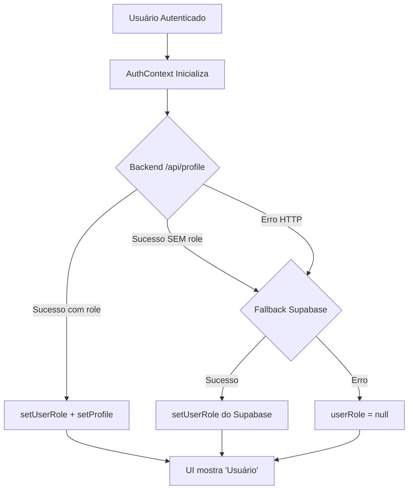

# Role Flow - Sistema de Papéis (Roles)

## Visão Geral

Este documento explica como o sistema de papéis (roles) funciona na aplicação Previso, incluindo fontes de dados, estratégias de extração, e como validar o comportamento em produção.

## Fonte de Verdade

O sistema segue uma estratégia de **prioridade em cascata** para determinar o papel (role) do usuário:

### 1. Backend API (`/api/profile`) - PRIORIDADE PRIMÁRIA
- **Endpoint**: `GET /api/profile`
- **Prioridade**: Mais alta
- **Quando usar**: Sempre tentado primeiro
- **Formato esperado**: JSON com campo `role`

A API backend é a **fonte de verdade autoritativa** para o role do usuário. O sistema tenta buscar o perfil do backend primeiro.

### 2. Supabase (`public.profiles`) - FALLBACK
- **Tabela**: `public.profiles`
- **Prioridade**: Fallback quando backend falha ou não retorna role
- **Quando usar**: 
  - Backend retorna erro HTTP (500, 404, network error, etc.)
  - Backend retorna 200 OK mas sem campo `role` no payload

## Estratégia de Extração de Role

O sistema suporta **múltiplos formatos de payload** para máxima compatibilidade:

### Formatos Suportados (em ordem de prioridade):

```javascript
// 1. Campo direto 'role'
{ 
  role: 'admin',
  email: 'user@example.com'
}

// 2. Campo 'user_role'
{ 
  user_role: 'therapist',
  email: 'user@example.com'
}

// 3. Aninhado em 'data.role'
{ 
  data: {
    role: 'patient',
    email: 'user@example.com'
  }
}

// 4. Aninhado em 'profile.role'
{ 
  profile: {
    role: 'admin',
    email: 'user@example.com'
  }
}
```

### Implementação

A extração é feita em `src/contexts/AuthContext.jsx`:

```javascript
const extractedRole = apiProfileData?.role || 
                      apiProfileData?.user_role || 
                      apiProfileData?.data?.role || 
                      apiProfileData?.profile?.role || 
                      null;
```

## Fluxo de Carregamento



## Exibição no Sidebar

O componente `Sidebar` usa uma estratégia de **role efetivo** para garantir exibição imediata:

```javascript
const effectiveRole = userRole ?? profile?.role ?? null;
```

Esta abordagem garante que:
- Se `userRole` está definido (do backend ou Supabase), usa ele
- Se `userRole` é null mas `profile.role` existe, usa `profile.role`
- Se ambos são null, mostra "Usuário" como padrão

### Mapeamento de Labels

| Role | Label Exibido | Ícone |
|------|---------------|-------|
| `admin` | Admin | Shield |
| `therapist` | Terapeuta | UserCog |
| `patient` | Paciente | User |
| `null` | Usuário | User |

## Validação em Produção

### Via Network Inspector

1. Abra o DevTools (F12)
2. Vá para aba **Network**
3. Recarregue a página
4. Procure por `profile` na lista de requisições
5. Clique na requisição `/api/profile`
6. Verifique a aba **Response**

**Exemplo de resposta esperada:**
```json
{
  "id": "abc-123",
  "email": "admin@example.com",
  "role": "admin",
  "created_at": "2024-01-01T00:00:00Z"
}
```

### Via Console

Execute no console do navegador:

```javascript
// 1. Verificar contexto de autenticação (React DevTools)
// Procure pelo componente AuthProvider e inspecione props/state

// 2. Verificar localStorage
console.log('Session:', localStorage.getItem('supabase.auth.token'));

// 3. Fazer requisição manual
fetch('https://seu-backend.com/api/profile', {
  headers: {
    'Authorization': 'Bearer ' + 'SEU_TOKEN_AQUI'
  }
})
.then(r => r.json())
.then(console.log);
```

### Logs de Desenvolvimento

Em modo **development**, o AuthContext emite logs detalhados:

```javascript
// Ativar logs (já habilitado em dev)
// Procure no console por:
[AuthContext] Perfil carregado via API backend: {...}
[AuthContext] Role extraído: admin
[AuthContext] Backend retornou sucesso mas sem campo role, tentando fallback Supabase...
```

**Nota**: Logs com `console.debug` só aparecem em modo development (`import.meta.env.MODE === 'development'`).

## Troubleshooting

### Problema: Sidebar mostra "Usuário" em vez de "Admin"

**Possíveis causas:**

1. **Backend não retorna campo `role`**
   - **Solução**: Verifique a resposta de `/api/profile` via Network
   - **Fix**: Atualize o backend para incluir campo `role`

2. **Backend retorna role em formato não suportado**
   - **Exemplo**: `{ user: { role: 'admin' } }`
   - **Solução**: Adicione novo formato em `AuthContext.jsx`:
     ```javascript
     const extractedRole = ... || apiProfileData?.user?.role || null;
     ```

3. **Fallback Supabase também falha**
   - **Causa**: RLS (Row Level Security) bloqueando acesso
   - **Solução**: Verifique políticas RLS na tabela `profiles`
   - **SQL para verificar**:
     ```sql
     SELECT * FROM pg_policies WHERE tablename = 'profiles';
     ```

4. **userRole e profile.role ambos null**
   - **Causa**: Backend E Supabase retornaram dados sem role
   - **Solução**: Verifique dados diretamente no Supabase:
     ```sql
     SELECT id, email, role FROM profiles WHERE email = 'seu-email@example.com';
     ```

### Problema: Backend em Produção Usa Formato Diferente

**Cenário**: Backend retorna `{ userRole: 'admin' }` em vez de `{ role: 'admin' }`

**Solução Temporária (Frontend)**:
1. Adicione novo formato suportado em `AuthContext.jsx`
2. Abra PR para normalizar formato no backend

**Solução Permanente (Backend)**:
1. Padronize resposta para incluir `role` diretamente
2. Mantenha compatibilidade com formatos antigos por período de transição

### Problema: Role Muda Durante Sessão

**Causa**: Usuário teve role atualizado no banco de dados

**Comportamento esperado**:
- Role só atualiza ao fazer login novamente
- `onAuthStateChange` NÃO recarrega perfil automaticamente

**Solução**:
- Implemente refresh manual via botão "Recarregar Perfil"
- Ou force logout/login após mudança de role

### Problema: Loop Infinito de Requisições

**Causa**: Código tentando recarregar perfil indefinidamente

**Prevenção no código atual**:
- ✅ Não há loop - fallback só executa uma vez
- ✅ Se ambos falham, `userRole` fica `null` e para

**Como verificar**:
1. Abra Network tab
2. Procure por múltiplas requisições idênticas para `/api/profile`
3. Se houver, verifique `useEffect` dependencies em AuthContext

## Testes

O sistema possui cobertura de testes para os seguintes cenários:

### AuthContext (`tests/contexts/AuthContext.profile-role.test.js`)

- ✅ Backend retorna `{ role: 'admin' }` → `userRole = 'admin'`
- ✅ Backend retorna `{ user_role: 'therapist' }` → extração funciona
- ✅ Backend retorna `{ data: { role: 'patient' } }` → extração funciona
- ✅ Backend retorna 200 sem role → fallback Supabase
- ✅ Backend falha E Supabase falha → `userRole = null`, sem loop
- ✅ Backend erro HTTP → fallback Supabase

### Sidebar (`tests/components/Sidebar.role-label.test.js`)

- ✅ `userRole = 'admin'` → exibe "Admin"
- ✅ `userRole = null, profile.role = 'admin'` → exibe "Admin"
- ✅ `userRole = null, profile = null` → exibe "Usuário"
- ✅ `userRole` tem prioridade sobre `profile.role`
- ✅ Console Admin link só aparece para admin
- ✅ Ícones corretos (Shield para admin, UserCog para therapist, User para patient)

## Logs e Observabilidade

### Modo Development

Logs detalhados são emitidos:
```javascript
console.debug('[AuthContext] Perfil carregado via API backend:', data);
console.debug('[AuthContext] Role extraído:', role);
console.debug('[AuthContext] Perfil carregado via Supabase (fallback):', data);
```

### Modo Production

Apenas logs de erro:
```javascript
console.error('[AuthContext] Erro ao buscar perfil via API backend:', error);
console.warn('[AuthContext] Backend retornou sucesso mas sem campo role...');
```

## Manutenção

### Adicionar Novo Formato de Payload

1. Edite `src/contexts/AuthContext.jsx`
2. Adicione novo caminho de extração:
   ```javascript
   const extractedRole = ... || apiProfileData?.seu_novo_campo || null;
   ```
3. Adicione teste em `tests/contexts/AuthContext.profile-role.test.js`
4. Execute testes: `npm test`

### Adicionar Novo Role

1. Atualize `getRoleLabel()` em `src/components/Sidebar.jsx`
2. Adicione ícone apropriado
3. Adicione testes em `tests/components/Sidebar.role-label.test.js`
4. Atualize esta documentação

## Recursos Adicionais

- [Supabase Row Level Security](https://supabase.com/docs/guides/auth/row-level-security)
- [React Context Best Practices](https://react.dev/learn/passing-data-deeply-with-context)
- [Jest Testing Guide](https://jestjs.io/docs/getting-started)

## Histórico de Mudanças

| Data | Mudança | Autor |
|------|---------|-------|
| 2025-11-24 | Implementação inicial com extração robusta e fallback | GitHub Copilot |
